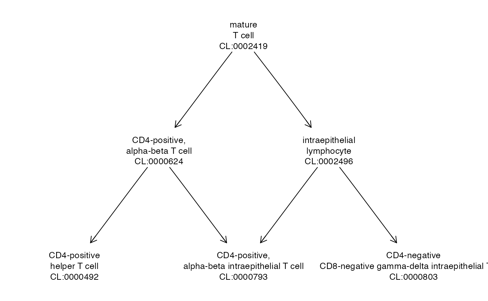

<div id="main" class="col-md-9" role="main">

# ontoProc2 -- leveraging semantic SQL for ontology analysis in Bioconductor

<div class="section level2">

## Introduction

The ontoProc2 package has two aims:

-   to give convenient access to the ontologies that are transformed to
    “semantic SQL” in the [INCAtools semantic sql
    project](https://github.com/INCATools/semantic-sql);
-   to simplify operations that have been available in
    [ontoProc](https://git.bioconductor.org/packages/ontoProc), which
    will be deprecated in 2027.

</div>

<div class="section level2">

## Acquiring ontologies

<div class="section level3">

### Make a connection

The best way to work with an ontology in this system is to use
`semsql_connect`. The `ontology` argument will be a short string that
the INCAtools project uses as part of the filename for the ontology. For
Gene Ontology, the string is “go”.

<div id="cb1" class="sourceCode">

``` r
library(ontoProc2)
goss = semsql_connect(ontology="go")
goss
```

</div>

    ## <SemsqlConn>  prefix: GO  | labeled terms: 88,356

</div>

<div class="section level3">

### Make a report

The `report` method provides details.

<div id="cb3" class="sourceCode">

``` r
report(goss)
```

</div>

    ## 
    ## ============================================================ 
    ## SemsqlConn Object
    ## ============================================================ 
    ## 
    ## Connection Details:
    ## ---------------------------------------- 
    ##   Database path:    /Users/vincentcarey/Library/Caches/org.R-project.R/R/BiocFileCache/40e293b372b_go.db 
    ##   Ontology prefix:  GO 
    ##   Status:           ✓   Connected 
    ## 
    ## Database Statistics:
    ## ---------------------------------------- 
    ##   Labeled terms:    88,356 
    ##   Direct edges:     214,146 
    ##   Entailed edges:   9,336,957 
    ##   Definitions:      55,200 
    ## 
    ## Terms by Prefix (top 5):
    ## ---------------------------------------- 
    ##   GO:              48,251
    ##   CHEBI:           23,969
    ##   _:               7,497
    ##   UBERON:          4,783
    ##   CL:              1,307
    ## 
    ## Key Tables Available:
    ## ---------------------------------------- 
    ##   ✓  rdfs_label_statement 
    ##   ✓  has_text_definition_statement 
    ##   ✓  edge 
    ##   ✓  entailed_edge 
    ##   ✓  rdfs_subclass_of_statement 
    ##   ✓  owl_some_values_from 
    ##   ✓  has_oio_synonym_statement 
    ## 
    ## ============================================================ 
    ## Use methods like search_labels(), get_ancestors(), etc.
    ## Run ?SemsqlConn for documentation.
    ## ============================================================

</div>

<div class="section level3">

### Probe the back end

The back end is SQLite. We can enumerate the tables available:

<div id="cb5" class="sourceCode">

``` r
library(dplyr)
```

</div>

    ## 
    ## Attaching package: 'dplyr'

    ## The following objects are masked from 'package:stats':
    ## 
    ##     filter, lag

    ## The following objects are masked from 'package:base':
    ## 
    ##     intersect, setdiff, setequal, union

<div id="cb9" class="sourceCode">

``` r
library(DBI)
allt = dbListTables(goss@con)
length(allt)
```

</div>

    ## [1] 100

<div id="cb11" class="sourceCode">

``` r
head(allt)
```

</div>

    ## [1] "all_problems"                    "annotation_property_node"       
    ## [3] "anonymous_class_expression"      "anonymous_expression"           
    ## [5] "anonymous_individual_expression" "anonymous_property_expression"

</div>

<div class="section level3">

### Use tidy methods

Individual tables are readily accessible.

<div id="cb13" class="sourceCode">

``` r
library(DT)
tbl(goss@con, "statements")
```

</div>

    ## # Source:   table<`statements`> [?? x 8]
    ## # Database: sqlite 3.51.2 [/Users/vincentcarey/Library/Caches/org.R-project.R/R/BiocFileCache/40e293b372b_go.db]
    ##    stanza                 subject predicate object value datatype language graph
    ##    <chr>                  <chr>   <chr>     <chr>  <chr> <chr>    <chr>    <chr>
    ##  1 obo:go/extensions/go-… obo:go… owl:vers… NA     2026… NA       NA       NA   
    ##  2 obo:go/extensions/go-… obo:go… oio:hasO… NA     1.2   NA       NA       NA   
    ##  3 obo:go/extensions/go-… obo:go… oio:defa… NA     gene… NA       NA       NA   
    ##  4 obo:go/extensions/go-… obo:go… dcterms:… cc:by… NA    NA       NA       NA   
    ##  5 obo:go/extensions/go-… obo:go… dce:title NA     Gene… NA       NA       NA   
    ##  6 obo:go/extensions/go-… obo:go… dce:desc… NA     The … NA       NA       NA   
    ##  7 obo:go/extensions/go-… obo:go… IAO:0000… GO:00… NA    NA       NA       NA   
    ##  8 obo:go/extensions/go-… obo:go… IAO:0000… GO:00… NA    NA       NA       NA   
    ##  9 obo:go/extensions/go-… obo:go… IAO:0000… GO:00… NA    NA       NA       NA   
    ## 10 obo:go/extensions/go-… obo:go… owl:vers… obo:g… NA    NA       NA       NA   
    ## # ℹ more rows

<div id="cb15" class="sourceCode">

``` r
tbl(goss@con, "statements") |> head(20) |> as.data.frame() |> datatable()
```

</div>

<div id="htmlwidget-ac96cb3ee4656e2e9ec3"
class="datatables html-widget html-fill-item"
style="width:100%;height:auto;">

</div>

To investigate the ontology, searching through RDF labels is a natural
approach.

<div id="cb16" class="sourceCode">

``` r
search_labels(goss, "apoptosis") |> head() |> datatable()
```

</div>

<div id="htmlwidget-e5c8c404fe174e4c81bd"
class="datatables html-widget html-fill-item"
style="width:100%;height:auto;">

</div>

Additional filtering could be useful here to focus on GO terms. The
`_riog...` labels have special roles in RDF inference, and this will be
addressed in vignettes to be added in the future.

Let’s improve the query:

<div id="cb17" class="sourceCode">

``` r
search_labels(goss, "apoptosis") |> filter(grepl("^GO:", subject)) |> head() |> datatable()
```

</div>

<div id="htmlwidget-36aa3d2a04d42bbc2145"
class="datatables html-widget html-fill-item"
style="width:100%;height:auto;">

</div>

Clearly it will be valuable to filter away obsolete terms. We will
investigate the use of edge tables to accomplish this in a future
vignette.

</div>

</div>

<div class="section level2">

## Transformation to ontology\_index instances

The [ontologyX
suite](https://academic.oup.com/bioinformatics/article/33/7/1104/2843897)
of Daniel Greene and colleagues provides very convenient ontology
handling functions. We can transform the SQLite data to this format.
We’ll illustrate with cell ontology.

<div id="cb18" class="sourceCode">

``` r
clss = semsql_connect(ontology="cl")
```

</div>

    ## Connected to SemanticSQL database: /Users/vincentcarey/Library/Caches/org.R-project.R/R/BiocFileCache/40e27456c620_cl.db

    ## Primary ontology prefix: CL

<div id="cb21" class="sourceCode">

``` r
cloi = semsql_to_oi(clss@con)
```

</div>

    ## Warning in ontologyIndex::ontology_index(name = nn, parents = pl): Some parent
    ## terms not found: BFO:0000002, BFO:0000004, SO:0000704 (16 more)

<div id="cb23" class="sourceCode">

``` r
cloi
```

</div>

    ## Ontology with 18801 terms
    ## 
    ## Properties:
    ##  id: character
    ##  name: list
    ##  parents: list
    ##  children: list
    ##  ancestors: list
    ##  obsolete: logical
    ## Roots:
    ##  UBERON:0000105 - life cycle stage
    ##  GO:0008150 - biological_process
    ##  GO:0003674 - molecular_function
    ##  UBERON:0000465 - material anatomical entity
    ##  UBERON:0000466 - immaterial anatomical entity
    ##  GO:0005575 - cellular_component
    ##  PATO:0000001 - quality
    ##  PR:000010543 - myeloperoxidase
    ##  IAO:0000027 - data item
    ##  NCBITaxon:131567 - cellular organisms
    ##  ... 940 more

A convenience function assists with visualizations:

<div id="cb25" class="sourceCode">

``` r
onto_plot2(cloi, c("CL:0000624", "CL:0000492", "CL:0000793", "CL:0000803"))
```

</div>



</div>

<div class="section level2">

## Background

The S7 class design in this package was initiated by a request to
Anthropic Claude to use S7 in establishing code that mirrors the tasks
accomplished in the [INCAtools jupyter
notebook](https://github.com/INCATools/semantic-sql/blob/main/notebooks/SemanticSQL-Tutorial.ipynb).

<div class="section level3">

### Searching in label text

The code of `search_labels` is:

<div id="cb26" class="sourceCode">

``` r
library(S7)
method(search_labels, SemsqlConn)
```

</div>

    ## <S7_method> method(search_labels, ontoProc2::SemsqlConn)
    ## function (x, pattern, limit = 20L) 
    ## {
    ##     query <- sprintf("\n    SELECT subject, value AS label\n    FROM rdfs_label_statement\n    WHERE value LIKE '%%%s%%'\n    LIMIT %d\n  ", 
    ##         pattern, limit)
    ##     dbGetQuery(x@con, query)
    ## }
    ## <environment: namespace:ontoProc2>

</div>

<div class="section level3">

### Exploring concept properties with ‘edge tables’

The INCAtools notebook discusses the fact that `rdfs_label_statement` is
a SQLite table “view”.

The notebook indicates that a SPARQL query on an RDF store for the
following computation would be “quite hard”. We want to find all the
“edges” leading from “enteric neuron”, which would constitute the set of
subject-predicate-object statements about this cell type with “enteric
neuron” as subject.

In this code we use the concept of a “CURIE” (Compact Uniform Resource
Identifier): a fixed length numerical identifier with a prefix
indicating the source ontology in which the ontologic concept is based.

<div id="cb28" class="sourceCode">

``` r
if (!is_connected(clss)) clss = reconnect(clss)
entcurie = search_labels(clss, "enteric neuron") |> 
  filter(grepl("^CL", subject)) |> dplyr::select(subject) |> unlist()
entcurie
```

</div>

    ##      subject 
    ## "CL:0007011"

<div id="cb30" class="sourceCode">

``` r
get_direct_edges(clss, entcurie)
```

</div>

    ##      subject  subject_label       predicate   predicate_label         object
    ## 1 CL:0007011 enteric neuron     BFO:0000050           part of UBERON:0002005
    ## 2 CL:0007011 enteric neuron     BFO:0000050           part of UBERON:0002005
    ## 3 CL:0007011 enteric neuron      RO:0002100 has soma location UBERON:0002005
    ## 4 CL:0007011 enteric neuron      RO:0002100 has soma location UBERON:0002005
    ## 5 CL:0007011 enteric neuron      RO:0002202     develops from     CL:0002607
    ## 6 CL:0007011 enteric neuron rdfs:subClassOf              <NA>     CL:0000029
    ## 7 CL:0007011 enteric neuron rdfs:subClassOf              <NA>     CL:0000107
    ##                          object_label
    ## 1              enteric nervous system
    ## 2              enteric nervous system
    ## 3              enteric nervous system
    ## 4              enteric nervous system
    ## 5 migratory enteric neural crest cell
    ## 6         neural crest derived neuron
    ## 7                    autonomic neuron

Here the underlying code is performing a join:

<div id="cb32" class="sourceCode">

``` r
method(get_direct_edges, SemsqlConn)
```

</div>

    ## <S7_method> method(get_direct_edges, ontoProc2::SemsqlConn)
    ## function (x, term_id, direction = c("outgoing", "incoming", "both")) 
    ## {
    ##     direction <- match.arg(direction)
    ##     where_clause <- switch(direction, outgoing = sprintf("e.subject = '%s'", 
    ##         term_id), incoming = sprintf("e.object = '%s'", term_id), 
    ##         both = sprintf("e.subject = '%s' OR e.object = '%s'", 
    ##             term_id, term_id))
    ##     query <- sprintf("\n    SELECT\n      e.subject,\n      sl.value AS subject_label,\n      e.predicate,\n      pl.value AS predicate_label,\n      e.object,\n      ol.value AS object_label\n    FROM edge e\n    LEFT JOIN rdfs_label_statement sl ON e.subject = sl.subject\n    LEFT JOIN rdfs_label_statement pl ON e.predicate = pl.subject\n    LEFT JOIN rdfs_label_statement ol ON e.object = ol.subject\n    WHERE %s\n  ", 
    ##         where_clause)
    ##     dbGetQuery(x@con, query)
    ## }
    ## <environment: namespace:ontoProc2>

</div>

<div class="section level3">

### Generalizing a concept: Ancestors

The notebook mentions that the “entailed edges” table includes all
statements that can be inferred from the application of base axioms of
the ontology.

<div id="cb34" class="sourceCode">

``` r
get_ancestors(clss, entcurie)
```

</div>

    ##                id                            label       predicate
    ## 1     BFO:0000002                             <NA> rdfs:subClassOf
    ## 2     BFO:0000004                             <NA> rdfs:subClassOf
    ## 3     BFO:0000040                             <NA> rdfs:subClassOf
    ## 4  UBERON:0001062                anatomical entity rdfs:subClassOf
    ## 5  UBERON:0000061             anatomical structure rdfs:subClassOf
    ## 6      CL:0000107                 autonomic neuron rdfs:subClassOf
    ## 7      CL:0000000                             cell rdfs:subClassOf
    ## 8      CL:0000211         electrically active cell rdfs:subClassOf
    ## 9      CL:0000393     electrically responsive cell rdfs:subClassOf
    ## 10     CL:0000404      electrically signaling cell rdfs:subClassOf
    ## 12     CL:0000255                  eukaryotic cell rdfs:subClassOf
    ## 13 UBERON:0000465       material anatomical entity rdfs:subClassOf
    ## 14     CL:0002319                      neural cell rdfs:subClassOf
    ## 15     CL:0000029      neural crest derived neuron rdfs:subClassOf
    ## 16     CL:0000540                           neuron rdfs:subClassOf
    ## 17     CL:2000032 peripheral nervous system neuron rdfs:subClassOf

</div>

<div class="section level3">

### Working with multiple ontologies

The INCAtools notebook includes an example of finding all neurons that
are part of the forebrain. This involves identifying CURIEs for
relations and anatomical structures, thus working with the relational
ontology (RO) and UBERON.

<div id="cb36" class="sourceCode">

``` r
ub = semsql_connect(ontology="uberon")
```

</div>

    ## Connected to SemanticSQL database: /Users/vincentcarey/Library/Caches/org.R-project.R/R/BiocFileCache/40e22de1c3cc_uberon.db

    ## Primary ontology prefix: UBERON

<div id="cb39" class="sourceCode">

``` r
ro = semsql_connect(ontology="ro")
```

</div>

    ## Connected to SemanticSQL database: /Users/vincentcarey/Library/Caches/org.R-project.R/R/BiocFileCache/53b7a3ff554_ro.db

    ## Primary ontology prefix: RO

First question: What’s the CURIE for “forebrain” in UBERON?

<div id="cb42" class="sourceCode">

``` r
fbcur = search_labels(ub, "forebrain", limit=1000) |> filter(label=="forebrain") |>
  select(subject) |> unlist()
fbcur
```

</div>

    ##          subject 
    ## "UBERON:0001890"

Second question: What’s the CURIE for “has soma location” in RO?

<div id="cb44" class="sourceCode">

``` r
loccur = search_labels(ro, "has soma location") |> select(subject) |> unlist()
loccur
```

</div>

    ##      subject 
    ## "RO:0002100"

What’s the CURIE for “neuron”?

<div id="cb46" class="sourceCode">

``` r
ncur = search_labels(clss, "neuron", limit=1000) |> filter(label=="neuron") |>
  select(subject) |> unlist()
ncur
```

</div>

    ##      subject 
    ## "CL:0000540"

Now we use three steps to obtain the solution.

First, enumerate all cell types that are located in forebrain.

<div id="cb48" class="sourceCode">

``` r
clinfb = tbl(clss@con, "entailed_edge") |> filter(predicate == loccur, object == fbcur) |> 
         select(subject) |> collect() |> unlist() 
length(clinfb)
```

</div>

    ## [1] 185

Second, filter these to those identified as ‘subclassOf’ “neuron”.

<div id="cb50" class="sourceCode">

``` r
clisneur = tbl(clss@con, "entailed_edge") |> filter(predicate == "rdfs:subClassOf", object==ncur) |> 
         filter(subject %in% clinfb) |> select(subject) |> collect() |> unlist() 
length(clisneur)
```

</div>

    ## [1] 185

Finally, get the labels.

<div id="cb52" class="sourceCode">

``` r
tbl(clss@con, "rdfs_label_statement") |> filter(subject %in% clisneur) |> 
         select(subject, value) |> collect() |> DT::datatable()
```

</div>

<div id="htmlwidget-febe03efa1a2d8d52a86"
class="datatables html-widget html-fill-item"
style="width:100%;height:auto;">

</div>

</div>

</div>

<div class="section level2">

## Session information

<div id="cb53" class="sourceCode">

``` r
sessionInfo()
```

</div>

    ## R version 4.5.2 (2025-10-31)
    ## Platform: aarch64-apple-darwin20
    ## Running under: macOS Sequoia 15.7.4
    ## 
    ## Matrix products: default
    ## BLAS:   /System/Library/Frameworks/Accelerate.framework/Versions/A/Frameworks/vecLib.framework/Versions/A/libBLAS.dylib 
    ## LAPACK: /Library/Frameworks/R.framework/Versions/4.5-arm64/Resources/lib/libRlapack.dylib;  LAPACK version 3.12.1
    ## 
    ## locale:
    ## [1] en_US.UTF-8/en_US.UTF-8/en_US.UTF-8/C/en_US.UTF-8/en_US.UTF-8
    ## 
    ## time zone: America/New_York
    ## tzcode source: internal
    ## 
    ## attached base packages:
    ## [1] stats     graphics  grDevices utils     datasets  methods   base     
    ## 
    ## other attached packages:
    ## [1] S7_0.2.1         DT_0.34.0        DBI_1.3.0        dplyr_1.2.0     
    ## [5] ontoProc2_0.99.8 BiocStyle_2.38.0
    ## 
    ## loaded via a namespace (and not attached):
    ##  [1] utf8_1.2.6          rappdirs_0.3.4      sass_0.4.10        
    ##  [4] generics_0.1.4      RSQLite_2.4.6       digest_0.6.39      
    ##  [7] magrittr_2.0.4      evaluate_1.0.5      grid_4.5.2         
    ## [10] bookdown_0.46       fastmap_1.2.0       blob_1.3.0         
    ## [13] R.oo_1.27.1         jsonlite_2.0.0      ontologyIndex_2.12 
    ## [16] R.utils_2.13.0      ontologyPlot_1.7    graph_1.88.1       
    ## [19] BiocManager_1.30.27 purrr_1.2.1         crosstalk_1.2.2    
    ## [22] Rgraphviz_2.54.0    codetools_0.2-20    httr2_1.2.2        
    ## [25] textshaping_1.0.4   jquerylib_0.1.4     paintmap_1.0       
    ## [28] cli_3.6.5           rlang_1.1.7         dbplyr_2.5.2       
    ## [31] R.methodsS3_1.8.2   bit64_4.6.0-1       withr_3.0.2        
    ## [34] cachem_1.1.0        yaml_2.3.12         otel_0.2.0         
    ## [37] tools_4.5.2         memoise_2.0.1       filelock_1.0.3     
    ## [40] BiocGenerics_0.56.0 curl_7.0.0          vctrs_0.7.1        
    ## [43] R6_2.6.1            stats4_4.5.2        BiocFileCache_3.0.0
    ## [46] lifecycle_1.0.5     fs_1.6.6            htmlwidgets_1.6.4  
    ## [49] bit_4.6.0           ragg_1.5.0          pkgconfig_2.0.3    
    ## [52] desc_1.4.3          pkgdown_2.2.0       pillar_1.11.1      
    ## [55] bslib_0.10.0        glue_1.8.0          systemfonts_1.3.1  
    ## [58] xfun_0.56           tibble_3.3.1        tidyselect_1.2.1   
    ## [61] knitr_1.51          htmltools_0.5.9     rmarkdown_2.30     
    ## [64] compiler_4.5.2

</div>

</div>
